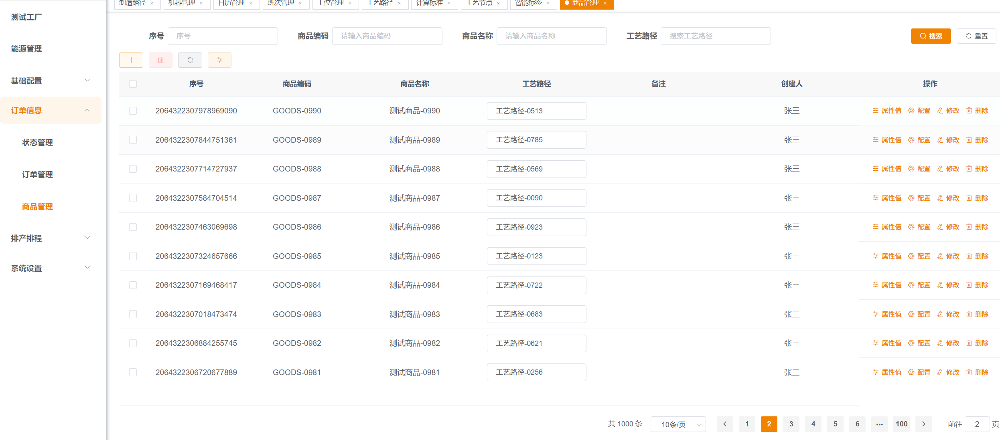
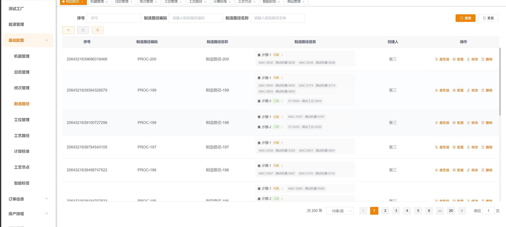
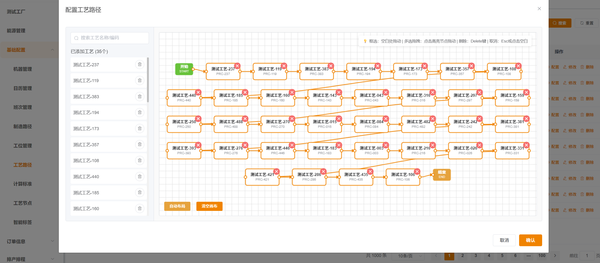
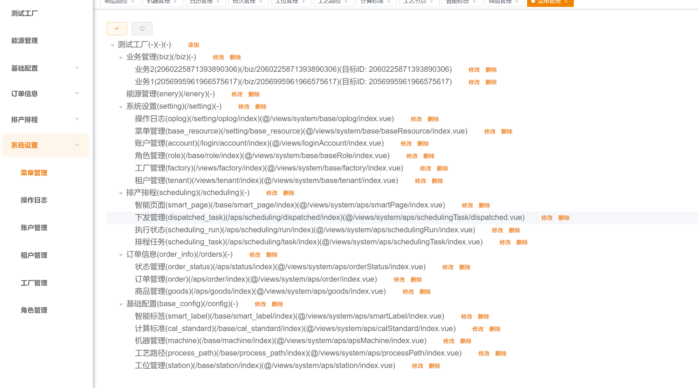

# **⚡ Smart Energy-Aware Production Scheduling Platform**

这是一个针对**工业调度、综合能源场景**以及复杂制造工艺约束打造的下一代智能高级计划与排程算法引擎平台。系统采用前置机器学习预测与后置运筹优化多阶段耦合的架构 ，在最大化生产效益的同时，平抑尖峰用电并满足双碳约束 。

  <table border="0" style="border-collapse: collapse; margin: 0 auto; text-align: center; width: 100%; max-width: 900px;">
    <tr>
      <td style="width: 50%; padding: 12px; border: none; text-align: center; vertical-align: middle;">
        
      </td>
      <td style="width: 50%; padding: 12px; border: none; text-align: center; vertical-align: middle;">
        
      </td>
     <td style="width: 50%; padding: 12px; border: none; text-align: center; vertical-align: middle;">
        
      </td>
      <td style="width: 50%; padding: 12px; border: none; text-align: center; vertical-align: middle;">
        
      </td>
    </tr>
  </table>

...

## **🧬 核心能力**

我们的能力涵盖但不限于以下工业场景与算法体系 ：

### **1\. 工业电力与综合能源场景**

* **中短期负荷分析与优化建议**  
  * **场景**：提取历史生产工单、现场生产节奏、用电特征及气候等多元要素，解析车间能耗模式，精准识别能效瓶颈与尖峰负荷风险，动态输出错峰用电方案 。  
  * **核心算法**：K-Means++ / Isolation Forest / LightGBM  
* **短期与超短期电价预测**  
  * **场景**：针对电力现货交易电价、动态分时电价、阶梯电价及实时动态波动电价进行价格走势预测，指导调整未来 1-3 天生产计划 。  
  * **核心算法**：ARIMA / Prophet / CatBoost / Quantile Regression  
* **工厂能源综合协同管理**  
  * **场景**：统筹工厂分布式光伏出力预测、储能系统充放电策略、以及柴油发电机/余热发电等多能互补调度 。  
  * **核心算法**：MILP (混合整数线性规划)  
* **设备灵活切换路径优化**  
  * **场景**：建模设备在加工、待机、休眠、关机、启动/预热等不同状态下的电能与资源消耗切换路径 。  
  * **核心算法**：Markov Decision Process / MINLP / CP (约束编程)  
* **双碳目标与碳足迹约束**  
  * **场景**：结合电网实时绿电比例与实时碳排放因子，计算并平抑排程方案的整体碳当量 。  
  * **核心算法**：NSGA (多目标遗传算法)

### **2\. 工艺拓扑、产能与供应链约束**

* **复杂工艺路径建模**  
  * **场景**：支持复杂工艺路径拓扑建模、工单自动拆分与合并，以及工序间复杂的相互依赖逻辑 。  
  * **核心算法**：CPM / GCN (图卷积网络) / TS  
* **柔性多替代工序建模**  
  * **场景**：解决工件多次返回同一设备组（如 PCBA、表面处理、半导体）或跨车间柔性流转时的调度冲突 。  
  * **核心算法**：TS / CP (Constraint Programming)  
* **刚性连续生产约束**  
  * **场景**：严密控制工序间最大/最小等待时间，满足化工、压铸工序防变质、防冷却的刚性时序约束 。  
  * **核心算法**：CP-SAT  
* **高能耗换线成本建模**  
  * **场景**：针对基于颜色、尺寸、材质等多维属性交叉形成的非线性换线时间与切换成本进行全局优化 。  
  * **核心算法**：LNS (大邻域搜索) / SA / ACO  
* **动态物料齐套性建模**  
  * **场景**：引入采购在途、动态到料对排程的刚性制约，避免停工待料 。  
  * **核心算法**：Rolling Horizon Optimization / Stochastic Programming  
* **实时重排与动态扰动响应**  
  * **场景**：针对插单、设备宕机、物料延迟等现场突发状态进行高鲁棒性敏捷调整 。  
  * **核心算法**：PPO (近端策略优化) / Incremental Scheduling

## **📦 交付体系**

我们提供从“业务定义”到“算法源码”，再到“数字化平台”的全周期交付方案：

| 交付模块 | 交付内容与核心价值 | 商务模式 |
| :---- | :---- | :---- |
| **1\. 业务咨询** |  **建模边界定义**：将制造一线口语化的业务现状，精准提炼为结构化的约束条件与优化目标 。 **多目标决策权衡**：在及时交付率、能耗成本、设备利用率等冲突指标间构建数学评估体系 。 |  **收费项目** |
| **2\. 算法交付** |  **多阶段算法耦合**：前置预测与后置运筹调度结合，确保多重极端硬约束下快速输出保底可行解 。**算法资产化**：源码遵循严格的分层架构，数据、预测、优化完全解耦，易于二次开发与复用 。 |  **收费项目** |
| **3\. 数字化平台** |  **软硬件级交付**：直接提供微服务架构、存-算-服解耦的排程底座平台，支持 Docker 容器化快速部署 。**标准化技术培训**：面向生管人员提供甘特图、能耗看板培训；面向技术团队提供参数调优与模型接口维护培训 。 |  **免费项目** |

## **🏗️ 体系架构**

系统采用现代云原生微服务架构，具备强大的异构数据清洗模块，可自动对齐现场混乱的 ERP / MES / 本地电力监控数据，实现算力与数据服务的无缝解耦 。

## **💬 联系我们**

💡 **具体合作细节与费用详聊** 。如果您需要针对贵司进行定制化的算法论证或 PoC 测试，欢迎随时与我们建立联系 ！

  <table border="0" style="border-collapse: collapse; margin: 0 auto; text-align: center; width: 40%; max-width: 900px;">
    <tr>
      <td style="width: 50%; padding: 12px; border: none; text-align: center; vertical-align: middle;">
        
      </td>
      <td style="width: 50%; padding: 12px; border: none; text-align: center; vertical-align: middle;">
              
      </td>
    </tr>
  </table>

